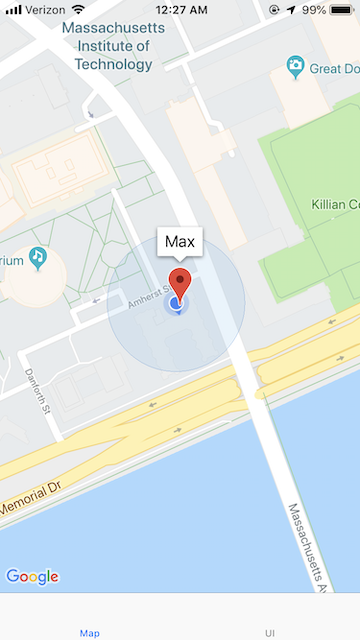
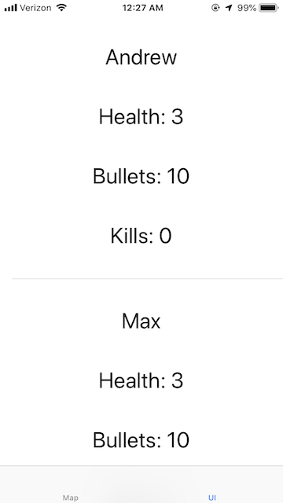
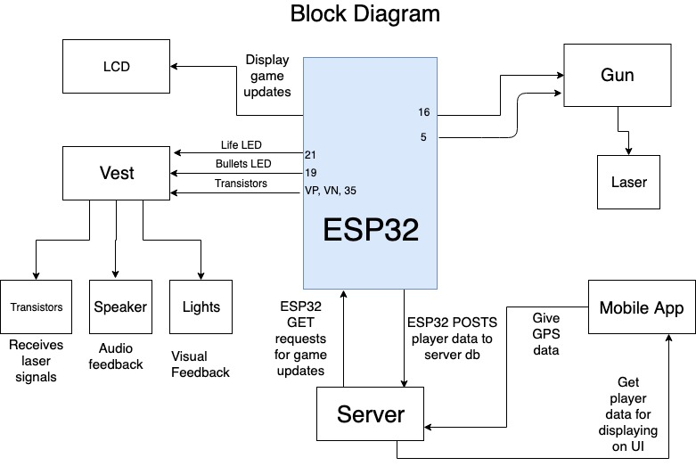

# 6.08

## Project Description
Lazer Tag is a game developed over the past few weeks that uses most of the techniques we learned in 6.08. Our Lazer tag is a variation of the regular laser tag game with the addition of a smartphone application and wifi connectedness within the game. Players start off in any location and ready up using their custom vest and gun hardware and get put into a game. In the app every player can see the locations of all the players anonymously to choose where or who to target next. The application also has all the game values for each player like lives and bullets to have an accurate representation of the game. The way for a player to win is to be the last man standing. For a player to “kill” another player thy have to use their own gun to take away the other players last life. We differentiate who killed who through encoding information through the laser used by each player. The last player with any lives is crowned the winner.

## App
This project is accompanied with a mobile app. The mobile app features pairing to ESP32's, and provides GPS locations of all players on a map (Google Maps). The app also has a UI that shows every player's data: username, health, and bullets.

## Block Diagram

## State Machines

## Challenges We Faced
We started the projects with the chlalenge of getting our parts a day before our second milestone. Alongside with that, we did not order the right parts for what we believed would work for our project. We ordered 5V laser diodes, instead of the 3.3V that the ESP32 could handle alongside with hardware PWM funcitonality. We believed photoresistors were the way to go, but we quickly found out they vary dramatically as far as what the output voltage will be, even with a laser shining on it.

Halfway thorughout the project, our instructors gave us the appropriate materials we needed to make a funcitoning laser tag game. We received phototransistors and 3.3V laser diodes which allowed for amazing readings with PWM functionality. With the correct hardware in place, it was a shocker to us that continiung on with the project was still difficult. We soon discovered that hardware PWM and having the ESP32 know when a laser is being fired was difficult. We used two pins for our laser gun system, one for the button and the other for the laser diode. This configuration for our laser gun made the hardware PWM not run how we wanted it to, when button is pressed allow for the laser to turn on with PWM. After days of debugging, we were told by our instructors to use the software implementation that we did in lab. Sure enough the software implementation worked, but not well enough for our purposes.

As we tested our code that was going to average the time between Off and On readings from multiple readings, we soon realized that not every shot was going to be perfect. The reason for PWM was to identify between different lasers so we can keep count of which player eliminates who. We tested shooting the phototransistors in a real world situation, so shooting the sensor briefly and from a distance, and the readings were no longer ideal. "No Problem! Let's just higher the PWM frequency." - Derek said. Well since we were using software PWM the laser diode bugged up and stayed on and showed no aspects of operating in PWM, at 10000+ Hz.

Our final problem came from our ESP32. Andrew had previously used RGB light strips on an Arduino and hoped that it would be similiar on the ESP32. Unfortunately, the lights sometimes did not do what they were supposed to and stayed lit up or turned off. The RGB light bar and ESP32 caused extra hours of stress when we knew that it should have worked. We just worked with it as we had some lights stay on as we prorgessed thorughout our project.

## Future Goals
In isolation, we had sound effects working on this system, including lobby music, and sound effects for shooting, reloading, winning, losing and getting shot. However, sound because difficult to implement when all features were merged together. These sound effects can be on the github repo. In the future, this cuold could be turned into a battle royale. Because GPS support exists, you could place different items and power ups periodically across a map. We would also like to add support for different kinds of weapons with different kinds of properties (more ammo, different firerate, etc). Going forward, we think that the lasers should be replaced with IR sensors for a stronger signal. Most laser tag systems do this and merely use lasers for visual feedback. This would make it easier to hit the transistor recievers. Because of the relatively weak signal generated by the laser, we were never able to distinguish between players with PWM frequency signals. Once this is done then different players could have different points, and thus a leaderboard. Additionally, we would like to add different game mode support such as team mode or free for all. For these respective modes, we would like to add communication channels (walkie talkies) to create a complete laser tag system.

